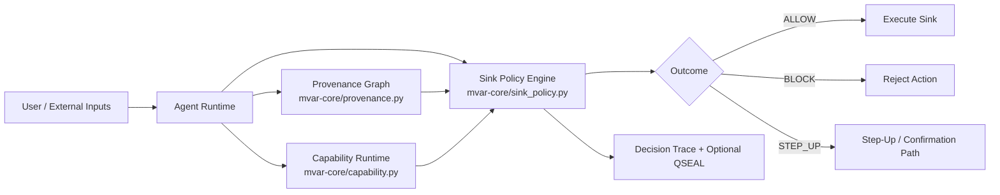
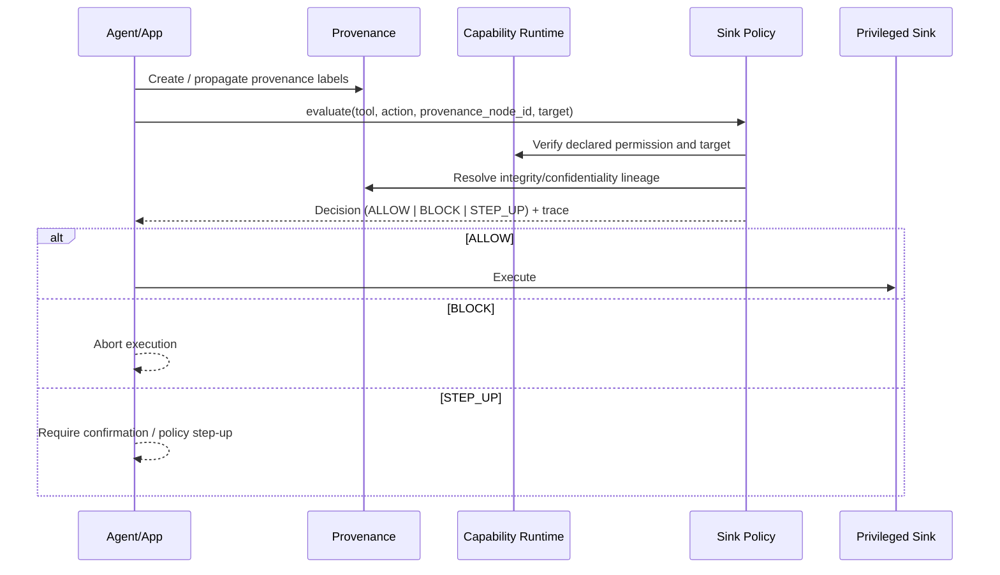
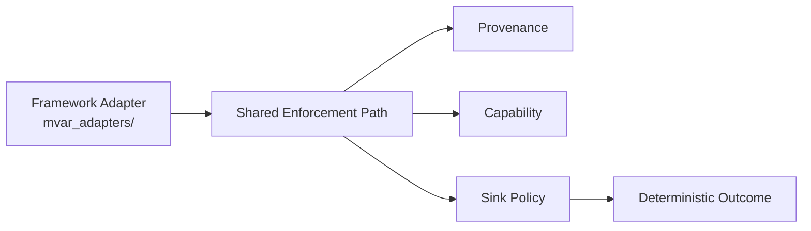

# MVAR Architecture

This document describes the shipped architecture of MVAR Phase 1.

## System Boundary

MVAR is an in-process enforcement layer for agent runtimes. It does not replace OS sandboxing.

## Enforcement Pipeline

Privileged actions are mediated at execution sinks through a deterministic decision path:

## Core Components

1. Provenance taint system: dual-lattice integrity/confidentiality labels with conservative propagation.
2. Capability runtime: deny-by-default permission model with per-target checks.
3. Sink policy engine: deterministic ALLOW/BLOCK/STEP_UP outcomes with traceable reasoning.
4. Adapter layer: framework-specific wrappers that route tool execution through sink-policy evaluation.

## Adapter Surfaces

First-party adapters exist for LangChain, OpenAI, MCP, Claude, AutoGen, CrewAI, and OpenClaw.

## Deterministic Invariant

The key Phase 1 invariant is:

`UNTRUSTED + CRITICAL -> BLOCK`

This gives structural enforcement at privileged sinks independent of payload semantics.

## Deployment Model (Phase 1)

- In-process library integration
- Explicit sink registration
- Optional QSEAL signing for tamper-evident decision artifacts
- Reproducible validation via `./scripts/launch-gate.sh`

## Validation Links

- Threat model and assumptions: [THREAT_MODEL.md](THREAT_MODEL.md)
- Adapter contract: [docs/ADAPTER_SPEC.md](docs/ADAPTER_SPEC.md)
- Conformance harness: [conformance/README.md](conformance/README.md)
- Research lineage: [DESIGN_LINEAGE.md](DESIGN_LINEAGE.md)
