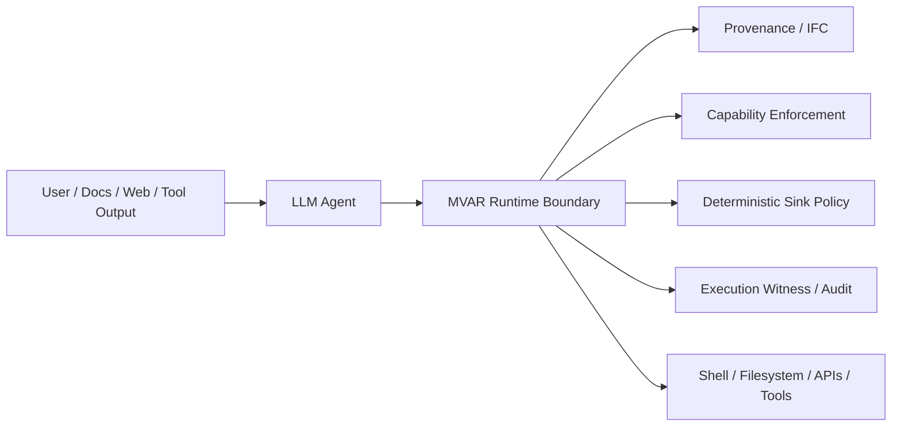

# MVAR Architecture

This document describes the shipped architecture of MVAR Phase 1.

## System Boundary

MVAR is an in-process enforcement layer for agent runtimes. It does not replace OS sandboxing.

```mermaid
flowchart LR
    A[User / Docs / Web / Tool Output] --> B[LLM Agent]
    B --> C[MVAR Runtime Boundary]
    C --> C1[Provenance / IFC]
    C --> C2[Capability Enforcement]
    C --> C3[Deterministic Sink Policy]
    C --> C4[Execution Witness / Audit]
    C --> D[Shell / Filesystem / APIs / Tools]
```

## Layer 1: Provenance / IFC

The provenance layer (`mvar-core/provenance.py`) implements dual-lattice taint tracking across integrity (`TRUSTED`/`UNTRUSTED`) and confidentiality (`PUBLIC`/`SENSITIVE`/`SECRET`) domains with conservative propagation. This means untrusted lineage persists through derived outputs, providing deterministic context at the point of authorization rather than relying on prompt-time heuristics.

## Layer 2: Capability Runtime

The capability layer (`mvar-core/capability.py`) enforces a deny-by-default execution model where tools must declare explicit permissions and allowed targets before use. Per-target checks and command allowlisting prevent ambient-authority execution paths and constrain tool actions to predeclared boundaries.

## Layer 3: Deterministic Sink Policy

The sink policy layer (`mvar-core/sink_policy.py`) evaluates each privileged action and returns one of three outcomes: `ALLOW`, `BLOCK`, or `STEP_UP`. It enforces structural invariants (for example `UNTRUSTED + CRITICAL -> BLOCK`) and records decision traces so authorization behavior is reproducible and testable across adapters.

## Layer 4: Execution Witness / Audit

The execution witness path binds policy decisions to execution context and emits tamper-evident decision artifacts. Optional QSEAL signing (Ed25519) provides cryptographic integrity for recorded outcomes and supports auditable post-hoc verification without changing the deterministic enforcement model.

## Adapter Surfaces

First-party adapters exist for LangChain, OpenAI, MCP, Claude, AutoGen, CrewAI, and OpenClaw.

## Deterministic Invariant

The key Phase 1 invariant is:

`UNTRUSTED + CRITICAL -> BLOCK`

This gives structural enforcement at privileged sinks independent of payload semantics.

## Deployment Model (Phase 1)

- In-process library integration
- Explicit sink registration
- Optional QSEAL signing for tamper-evident decision artifacts
- Reproducible validation via `./scripts/launch-gate.sh`

## Validation Links

- Threat model and assumptions: [THREAT_MODEL.md](THREAT_MODEL.md)
- Adapter contract: [docs/ADAPTER_SPEC.md](docs/ADAPTER_SPEC.md)
- Conformance harness: [conformance/README.md](conformance/README.md)
- Research lineage: [DESIGN_LINEAGE.md](DESIGN_LINEAGE.md)
