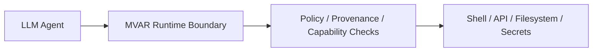

<picture>
  <source media="(prefers-color-scheme: dark)" srcset="./assets/banner_dark_mode.png">
  <source media="(prefers-color-scheme: light)" srcset="./assets/mvar-banner-light.png">
  
</picture>

# MVAR — Deterministic Security for AI Agents

**If your AI agent can run shell commands, call APIs, read files, or use credentials, prompt injection can escalate into real execution.**

Most defenses attempt to filter malicious prompts. That fails once model output reaches privileged tools.

**MVAR prevents this by enforcing deterministic policy between LLM output and execution sinks.** It works with modern agent runtimes, including MCP- and OpenClaw-style tool chains. See the governed runtime proof for a reproducible benign-pass / adversarial-block demo.

**MVAR is the execution firewall for AI agents.**

Invariant: `UNTRUSTED input + CRITICAL sink -> BLOCK`

`50 attack vectors blocked` · `200 benign vectors passed` · `CI-gated launch validation`

## Try It In 30 Seconds

[30-Second Proof](#30-second-proof) · [Quick Start](#quick-start) · [Governed MCP Proof](docs/outreach/GOVERNED_MCP_RUNTIME_PROOF.md) · [Adapters](docs/FIRST_PARTY_ADAPTERS.md)

[](https://github.com/mvar-security/mvar/actions/workflows/launch-gate.yml)
[](https://scorecard.dev/viewer/?uri=github.com/mvar-security/mvar)
[](./)
[](LICENSE.md)

---
## 30-Second Proof

```bash
git clone https://github.com/mvar-security/mvar.git
cd mvar
bash scripts/install.sh
bash scripts/run-agent-testbed.sh --scenario rag_injection
```

Expected result:

- Baseline runtime: attacker-influenced command is allowed
- MVAR runtime: execution is blocked before the tool runs
- Audit output: deterministic decision + cryptographic witness

```text
Baseline: ALLOW -> executing bash command
MVAR:    BLOCK -> UNTRUSTED input reaching CRITICAL sink
```

Governed runtime demo (MCP): [docs/outreach/GOVERNED_MCP_RUNTIME_PROOF.md](docs/outreach/GOVERNED_MCP_RUNTIME_PROOF.md)

⭐ Star the repo to follow development of execution-time security for AI agents.

## Quick Start

```python
from mvar import protect, ExecutionBlocked

safe_tool = protect(my_bash_tool)  # balanced profile by default
try:
    safe_tool("cat /etc/shadow")
except ExecutionBlocked as e:
    print(e.decision["outcome"])  # BLOCK
    print(e.decision["reason"])
```

Profiles: `balanced` (default), `strict`, `permissive`.

## What MVAR Is

MVAR is a deterministic execution security layer for LLM agents.

Most defenses attempt to detect malicious prompts. MVAR enforces policy at execution sinks, where prompt-injection attacks cause real system effects.

## Why This Is Different

- Not a prompt filter
- Not an LLM judge
- Deterministic policy at execution time
- Provenance-aware authorization
- Cryptographically auditable decisions

## Validation

- 50 prompt-injection attack vectors blocked before tool execution
- Governed runtime CI gate on every change
- Reproducibility and launch checks in versioned scripts

Current metrics and snapshots: [STATUS.md](STATUS.md), [TRUST.md](TRUST.md)

## Who This Is For

MVAR is for teams building agents that can:

- execute shell commands
- call external APIs
- read or write files
- handle credentials or sensitive data

If your agent can turn model output into real-world actions, MVAR constrains that authority at runtime.

## Deployment Modes (Current)

| Mode | Components | Status | Primary Use Case |
|---|---|---|---|
| Standalone MVAR | MVAR only | ✅ Shipped | Drop-in deterministic execution boundary |
| MVAR + Verify | MVAR + Entry 500 SDK | 🚧 Integration path | Add trust signals alongside sink enforcement |
| Full Governed Runtime | MVAR + Entry 500 + EOS + Execution Governor | 🚧 Scaffold / feature-flagged | Unified privileged-action control plane |

## Works With

- LangChain
- OpenAI tool calling
- OpenAI Agents SDK
- MCP
- Claude tool runtimes
- AutoGen
- CrewAI
- OpenClaw

Install first: [INSTALL.md#installation](INSTALL.md#installation)

Then pick an adapter quickstart: [docs/FIRST_PARTY_ADAPTERS.md](docs/FIRST_PARTY_ADAPTERS.md)

Need source + quickstart per adapter: [Adapter Code + Quickstart Map](docs/FIRST_PARTY_ADAPTERS.md#adapter-code--quickstart-map)

## Architecture At A Glance

```text
LLM reasoning
    |
    v
tool request
    |
    v
MVAR enforcement layer
    |
    v
shell / APIs / filesystem / secrets
```



Spec links:

- [`spec/execution_intent/v1.schema.json`](spec/execution_intent/v1.schema.json)
- [`spec/decision_record/v1.schema.json`](spec/decision_record/v1.schema.json)
- Execution contract model (one-page): [docs/architecture/execution_contract_model.md](docs/architecture/execution_contract_model.md)

## Verify in 60 Seconds

Fast path (works even if you forgot to activate the right venv):

```bash
bash scripts/doctor-environment.sh
bash scripts/quick-verify.sh
./run_proof_pack.sh
```

Manual path (from repo root):

```bash
bash scripts/run-python.sh -m pytest -q
bash scripts/launch-gate.sh
bash scripts/run-python.sh scripts/generate_security_scorecard.py
bash scripts/run-python.sh scripts/update_status_md.py
```

What this proves:
- Launch gate and full suite are green in CI
- Attack corpus blocks 50/50 under current policy
- Benign corpus has zero false blocks
- Exact current numbers are published in [STATUS.md](STATUS.md)
- Repro artifact pack is emitted under `artifacts/repro/<timestamp>/` with checksums and summary JSON

## Execution Witness Chain

MVAR can verify signed witness artifacts offline, including signature validity and previous-signature chain integrity.

```bash
mvar-verify-witness data/mvar_decisions.jsonl --require-chain
```

## Integration and Demos

- Use MVAR in your agent: [docs/integration/USE_MVAR_IN_YOUR_AGENT.md](docs/integration/USE_MVAR_IN_YOUR_AGENT.md)
- Demo and testbed catalog: [docs/demos/DEMOS_AND_TESTBEDS.md](docs/demos/DEMOS_AND_TESTBEDS.md)
- Adapter quickstarts: [docs/FIRST_PARTY_ADAPTERS.md](docs/FIRST_PARTY_ADAPTERS.md)

## What MVAR Is Not

MVAR is **not**:

- **Not a prompt filter** — MVAR does not attempt to detect or block malicious prompts
- **Not an LLM judge** — MVAR does not use a secondary model to classify intent
- **Not a replacement for OS sandboxing** — MVAR complements Docker/seccomp, does not replace them
- **Not a replacement for network security** — Firewalls, host hardening, and network isolation remain necessary
- **Not a malicious-intent detector** — MVAR enforces structural constraints, not behavioral anomaly detection

MVAR is a **deterministic reference monitor** at privileged execution sinks. It assumes untrusted inputs exist and prevents them from reaching critical operations, regardless of detection accuracy.

## What MVAR Blocks

MVAR has validated enforcement against these attack classes:

- **Prompt-injection-driven tool execution** ([tests/test_launch_redteam_gate.py](tests/test_launch_redteam_gate.py))
- **Credential exfiltration attempts** ([demo/extreme_attack_suite_50.py](demo/extreme_attack_suite_50.py), vectors 22-25)
- **Encoded/obfuscated malicious payloads** ([demo/extreme_attack_suite_50.py](demo/extreme_attack_suite_50.py), category 3)
- **Multi-step composition attacks** ([tests/test_composition_risk.py](tests/test_composition_risk.py))
- **Taint laundering via cache/logs/temp files** ([demo/extreme_attack_suite_50.py](demo/extreme_attack_suite_50.py), category 6)

See [STATUS.md](STATUS.md) for exact current validation numbers.

<details>
<summary><strong>What does MVAR block?</strong> 50 attack vectors · 9 categories · CI-gated on every commit</summary>

MVAR's sink policy was evaluated against a 50-vector adversarial corpus spanning 9 attack categories:

| Category | Vectors | Result |
|----------|---------|--------|
| Direct command injection | 6 | ✅ 6/6 blocked |
| Environment variable attacks | 5 | ✅ 5/5 blocked |
| Encoding/obfuscation (Base64, Unicode, hex) | 8 | ✅ 8/8 blocked |
| Shell manipulation (pipes, eval, substitution) | 7 | ✅ 7/7 blocked |
| Multi-stage attacks (download+execute) | 6 | ✅ 6/6 blocked |
| Taint laundering (cache, logs, temp files) | 5 | ✅ 5/5 blocked |
| Template escaping (JSON, XML, Markdown) | 5 | ✅ 5/5 blocked |
| Credential theft (AWS, SSH keys) | 4 | ✅ 4/4 blocked |
| Novel corpus variants | 4 | ✅ 4/4 blocked |

**Result:** Blocked every vector in the current validation corpus under the tested policy and sink configuration.

**Scope:** This demonstrates consistent enforcement for this validation corpus. Not a proof of completeness against all possible attacks.

</details>

## Deep Dive Documentation

This README is intentionally front-loaded for fast evaluation. Detailed material is split into focused docs:

- Why boundary enforcement (not prompt filtering): [docs/WHY_CONTROL_PLANE_NOT_FILTERS.md](docs/WHY_CONTROL_PLANE_NOT_FILTERS.md)
- Full architecture and design lineage: [ARCHITECTURE.md](ARCHITECTURE.md), [DESIGN_LINEAGE.md](DESIGN_LINEAGE.md)
- Execution contract model (current vs planned scope): [docs/architecture/execution_contract_model.md](docs/architecture/execution_contract_model.md)
- Validation showcases and attack trilogy: [docs/ATTACK_VALIDATION_SHOWCASE.md](docs/ATTACK_VALIDATION_SHOWCASE.md), [docs/AGENT_TESTBED.md](docs/AGENT_TESTBED.md)
- Integration examples: [docs/integration/USE_MVAR_IN_YOUR_AGENT.md](docs/integration/USE_MVAR_IN_YOUR_AGENT.md)
- Demos and reproducible testbeds: [docs/demos/DEMOS_AND_TESTBEDS.md](docs/demos/DEMOS_AND_TESTBEDS.md)
- Adapter contracts and integration playbook: [docs/ADAPTER_SPEC.md](docs/ADAPTER_SPEC.md), [docs/AGENT_INTEGRATION_PLAYBOOK.md](docs/AGENT_INTEGRATION_PLAYBOOK.md), [conformance/README.md](conformance/README.md)
- Security profiles, trust posture, and observability: [docs/SECURITY_PROFILES.md](docs/SECURITY_PROFILES.md), [TRUST.md](TRUST.md), [docs/OBSERVABILITY.md](docs/OBSERVABILITY.md)
- Agent-runtime risk class explainer: [docs/security/AGENT_RUNTIME_INCIDENT_CLASS.md](docs/security/AGENT_RUNTIME_INCIDENT_CLASS.md)
- Performance, non-goals, threat model: [docs/PERFORMANCE_AND_THREAT_MODEL.md](docs/PERFORMANCE_AND_THREAT_MODEL.md)
- Research paper: [docs/papers/execution-witness-binding.pdf](docs/papers/execution-witness-binding.pdf)

## Get Involved

- Run validation: `bash scripts/launch-gate.sh`
- Submit adversarial vectors: [docs/ATTACK_VECTOR_SUBMISSIONS.md](docs/ATTACK_VECTOR_SUBMISSIONS.md)
- Build adapters and integrations: [docs/BUILD_WITH_US.md](docs/BUILD_WITH_US.md)
- Use the pinned 30-second proof post: [docs/outreach/GITHUB_PINNED_POST_30S_PROOF.md](docs/outreach/GITHUB_PINNED_POST_30S_PROOF.md)

## Contributing

**MVAR is open source by design.** We welcome adapter integrations, security hardening, tests, and documentation improvements that preserve security invariants.
See [docs/BUILD_WITH_US.md](docs/BUILD_WITH_US.md) for contribution lanes, requirements, conformance expectations, and security reporting workflow.

---

## Notices

- [NOTICE.md](NOTICE.md)
- [THIRD_PARTY_NOTICES.md](THIRD_PARTY_NOTICES.md)
- [DISCLAIMERS.md](DISCLAIMERS.md)

---

## License

Apache License 2.0 — see [LICENSE.md](LICENSE.md)

**Patent:** US Provisional filed (Feb 24, 2026)

---

## Citation

Machine-readable citation metadata: [CITATION.cff](CITATION.cff)

```bibtex
@software{mvar2026,
  author = {Cohen, Shawn},
  title = {MVAR: MIRRA Verified Agent Runtime},
  year = {2026},
  url = {https://github.com/mvar-security/mvar},
  note = {Deterministic prompt injection defense via information flow control}
}
```

---

## Contact

**Shawn Cohen**
Email: security@mvar.io
GitHub: [@mvar-security](https://github.com/mvar-security)

---

*MVAR: Deterministic sink enforcement against prompt-injection-driven tool misuse via information flow control and cryptographic provenance tracking.*
